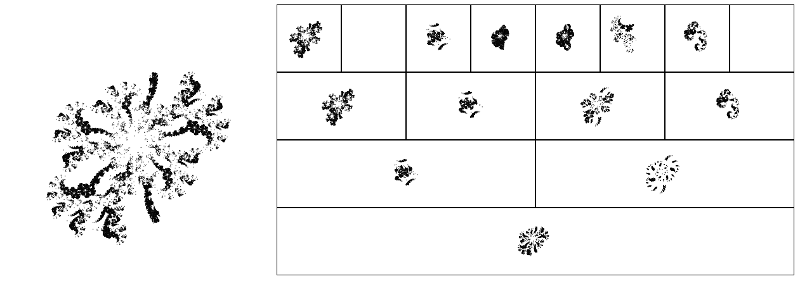

# Fractal Monsters Evolution

[Original Article](https://habr.com/ru/articles/328568/) (Russian language)

[Translated Article](https://github.com/xcontcom/fractals/blob/master/docs/article.md) (Engilsh)

[Live demo](https://fractal.xcont.com/)


## Overview

This project explores a single recursive fractal generation system — evolving it not through predefined fitness functions, but through direct **user interaction**. You pick the fractals you like, and the algorithm adapts.

Instead of natural selection, it’s **artificial selection by hand**. Each fractal is a product of user-guided evolution, based on **angle sequences** (the genotype) applied recursively to subdivide line segments.

The system creates a surprisingly deep space of visual forms.

> This project was created in **2017**, two years before the [Cellular Automata Evolution](https://github.com/xcontcom/cellular-automata-evolution) project — and stands as its conceptual predecessor.

## How It Works

- The genotype is an array of angles (in degrees).
- Starting from two points (A → B), a third point C is calculated using the current angle.
- The recursion splits the segment in two, creating more points based on those angles.
- The result: self-similar, often pseudo-chaotic shapes — **fractals**.

## Features
- **Genetic Algorithm with User Selection**: Evolves fractal angles (genotype) using crossover and mutation (e.g., 20% mutation rate), with users manually selecting preferred fractals to guide evolution across populations (e.g., 60 fractals, 3 populations, 20 per population).
- **Fractal Generation**: Produces fractals via a recursive geometric method starting with two points A and B, computing a third point C using an angle CAB, and recursively splitting into segments AC and CB with new angles.
- **Interactive Visualization**: Renders fractals in a web browser using HTML5 canvas, with controls for evolving populations and inspecting patterns.
- **Manual Fractal Design**: Supports user-defined fractal creation (`2d.html`, `2d.js`) by adding or editing angles, with mouse-based dynamic visualization of the evolving fractal.
- **Local Storage Persistence**: Stores populations and fractal parameters in browser local storage, enabling users to resume evolution sessions after closing the browser.
- **3D Fractal Experiments**: Includes advanced 3D fractal generation in `geom3d/`, extending the recursive method to three-dimensional space with mouse-driven rotation; while the PHP backend is legacy, the 3D visualization remains a significant feature.
- **Dope as Hell!**: I mean, c'mon! Check out the live demo. All those buttons are win98 style, and all those fractals have parent trees. o_O



## Project Structure
```
fractal-monsters-evolution/
├── css/                 # Styling for the interface
├── geom3d/              # Code for 3D fractal generation (with legacy PHP backend)
├── 2d.html              # Interface for building fractals with mouse input
├── 2d.js                # Logic for mouse-based fractal construction
├── 2points.html         # Same as 2d.html, but uses quadrilaterals instead of triangles
├── draw2points.js       # Drawing functions for quadrilaterals fractals
├── draw.js              # Fractal drawing and recursive generation functions
├── index.html           # Main interface for fractal visualization and evolution
├── init.js              # Genetic algorithm and population management logic
├── screenshots/         # Sample fractal images or GIFs
│   └── demo.gif
└── README.md            # Project documentation
```

## Technical Details
- **Genetic Algorithm**: Implements crossover and mutation to evolve angles defining fractal geometry, with evolution driven by user selection rather than a predefined fitness function.
- **Fractal Algorithm**: Uses a recursive geometric method starting with points A and B, computing point C with an angle CAB (genotype), and splitting into segments AC and CB, repeating with new angles up to a specified depth.
- **Visualization**: Renders fractals on an HTML5 canvas, with a simple Win98-inspired interface for user interaction.
- **Modularity**: Separates fractal generation (`draw.js`), evolution logic (`init.js`), and manual design (`2d.js`) from interfaces (`index.html`, `2d.html`).
- **Local Storage**: Persists population data and fractal parameters in browser local storage for continuity across sessions.
- **3D Fractal Generation**: Extends the recursive method to 3D in `geom3d/`, using angle pairs to define rotations around axes; includes mouse-driven rotation for dynamic viewing, though the PHP backend is legacy.
- **Output**: Supports exporting fractal images for analysis or documentation.

## Significance
This project, created in 2017, explores the use of genetic algorithms for evolving geometric fractals through user-driven selection, predating the 2019 [Cellular Automata Evolution](https://github.com/xcontcom/cellular-automata-evolution) project’s automated fitness-based approach. By focusing on interactive evolution, it provides a platform for studying user-influenced emergent patterns in computational geometry. Shared on GitHub, it offers researchers and enthusiasts a tool to investigate fractal systems and evolutionary dynamics.

## License
MIT License. See [LICENSE](LICENSE) for details.

## Contact
Serhii Herasymov  
sergeygerasimofff@gmail.com  
https://github.com/xcontcom
