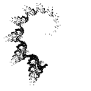
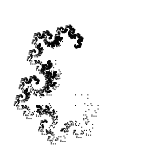
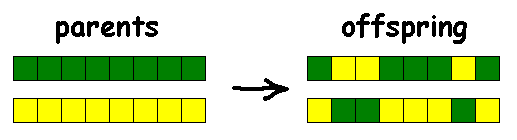
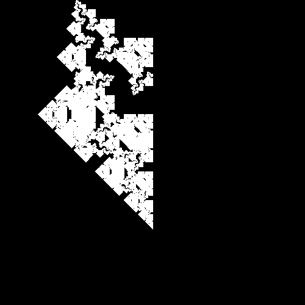

# Fractal Monsters Evolution

[Original Article](https://habr.com/ru/articles/328568/) 

Today we will draw geometric fractals, which are given undeservedly little attention. Meanwhile, each fractal here is a small masterpiece that amazes the imagination!


## Algorithm


Let's consider one interesting algorithm using the example of a well-known fractal - the Levy curve. We have two points A1 and A2. Let's find a point A3 for which the angle A1 = 45°, and the angle A3 = 90°.


We do the same operation for points A1, A3 and A3, A2.


And then recursively for each pair of points.

Third iteration:


At iteration 14, this curve looks like this:


More clearly in JavaScript:

```
  <canvas id="myCanvas"></canvas>
  <script>
    window.onload=function(){
      var canvas=document.getElementById('myCanvas');
      var context=canvas.getContext('2d');
      canvas.width=800, canvas.height=800;
      context.beginPath();
      recurs(context, 17, 400, 250, 400, 550); //рекурсивная функция, рисующая фрактальную кривую
      context.stroke();
    };
    var angle=45*Math.PI/180; //переводим углы в радианы
    function recurs(context, n, x0, y0, x1, y1){ //n итераций, Точки A1(x0,y0) и A2(x1,y1)
      if (n==0){
        context.moveTo(x0,y0);
        context.lineTo(x1,y1);
      }else{
        var xx=Math.cos(angle)*((x1-x0)*Math.cos(angle)-(y1-y0)*Math.sin(angle))+x0;
        var yy=Math.cos(angle)*((x1-x0)*Math.sin(angle)+(y1-y0)*Math.cos(angle))+y0; //находим точку A3
        recurs(context, n-1, x0, y0, xx, yy); //A1, A3
        recurs(context, n-1, xx, yy, x1, y1); //A3, A2
      }
    }
  </script>
```

By slightly modifying the above code, we can draw another well-known fractal curve - the Harter-Haytheway Dragon. To do this, starting from the second iteration, we will alternate angles of 45° and -45°


Third iteration:


At iteration 14, this curve looks like this:


Modified fragment of the source code

```
      }else{
        angle2=angle*k; // <-
        var xx=Math.cos(angle2)*((x1-x0)*Math.cos(angle2)-(y1-y0)*Math.sin(angle2))+x0;
        var yy=Math.cos(angle2)*((x1-x0)*Math.sin(angle2)+(y1-y0)*Math.cos(angle2))+y0;
        recurs(context, n-1, x0, y0, xx, yy, 1); //последний аргумент функции - k
        recurs(context, n-1, xx, yy, x1, y1, -1);
      }
```

We have changed our function just a little bit, adding one more angle to it, and the fractal has changed beyond recognition! In dynamics (we change the second angle in 5° increments):


And here our inquisitive mind starts asking questions. What if we try using other angle values, instead of [45,-45]? Say, [30,-60]. Or [30,-30,-60,60]. Let's rewrite our function so that it accepts an array of angles as one of the arguments.

The final version of the function

```
    function recurs(context, arr, position, n, x0, y0, x1, y1){
      if (n==0){
        context.fillRect(x1,y1, 1,1);
        return position;
      }else{
        if (!position[n]) position[n]=0;
        var xx=Math.cos(arr[position[n]])*((x1-x0)*Math.cos(arr[position[n]])-(y1-y0)*Math.sin(arr[position[n]]))+x0;
        var yy=Math.cos(arr[position[n]])*((x1-x0)*Math.sin(arr[position[n]])+(y1-y0)*Math.cos(arr[position[n]]))+y0;
        position[n]++;
        if (position[n]==arr.length) position[n]=0;
        position=recurs(context, arr, position, n-1, x0, y0, xx, yy);
        position=recurs(context, arr, position, n-1, xx, yy, x1, y1);
        return position;
      }
    }
// The array position stores the angle number from the array arr for the current recursion depth (n).
```

From now on we will draw only dots, without connecting them with lines... purely for aesthetic reasons. Fractal [30,-30,-60,60] drawn with lines and dots:


Special attention should be paid to the fact that all the dots A3 lie on a circle with a diameter of A1A2:


If the dots are inside (or outside) the circle, the fractal is too compressed (or vice versa - goes beyond the drawing area). Visually:


With this cosine we align the dots along the circle:

```
var xx=Math.cos(arr[position[n]])* ...
var yy=Math.cos(arr[position[n]])* ...
```

It is easy to see that using an angle of 120° we get the same point as with an angle of -60°. Therefore, all angles are in the range (-90°,90°).

Let's try to enter different combinations of angles into our script.

## "Little Masterpieces"

Several random fractals with angles of -45°/45° (clickable):

<table>
<tr>
  <td><a href="images/gallery/1.png"></a></td>
  <td><a href="images/gallery/2.png"></a></td>
  <td><a href="images/gallery/3.png"></a></td>
  <td><a href="images/gallery/4.png"></a></td>
</tr>
<tr>
  <td><a href="images/gallery/5.png"></a></td>
  <td><a href="images/gallery/6.png"></a></td>
  <td><a href="images/gallery/7.png"></a></td>
  <td><a href="images/gallery/8.png"></a></td>
</tr>
<tr>
  <td><a href="images/gallery/9.png"></a></td>
  <td><a href="images/gallery/10.png"></a></td>
  <td><a href="images/gallery/11.png"></a></td>
  <td><a href="images/gallery/12.png"></a></td>
</tr>
<tr>
  <td><a href="images/gallery/13.png"></a></td>
</tr>
</table>

With angles of -30°/30°/-60°/60°:

<table>
<tr>
  <td><a href="images/gallery/14.png"></a></td>
  <td><a href="images/gallery/15.png"></a></td>
  <td><a href="images/gallery/16.png"></a></td>
  <td><a href="images/gallery/17.png"></a></td>
</tr>
<tr>
  <td><a href="images/gallery/18.png"></a></td>
  <td><a href="images/gallery/19.png"></a></td>
  <td><a href="images/gallery/20.png"></a></td>
  <td><a href="images/gallery/21.png"></a></td>
</tr>
<tr>
  <td><a href="images/gallery/22.png"></a></td>
  <td><a href="images/gallery/23.png"></a></td>
  <td><a href="images/gallery/24.png"></a></td>
  <td><a href="images/gallery/25.png"></a></td>
</tr>
<tr>
  <td><a href="images/gallery/26.png"></a></td>
  <td><a href="images/gallery/27.png"></a></td>
  <td><a href="images/gallery/28.png"></a></td>
  <td><a href="images/gallery/29.png"></a></td>
</tr>
<tr>
  <td><a href="images/gallery/30.png"></a></td>
  <td><a href="images/gallery/31.png"></a></td>
  <td><a href="images/gallery/32.png"></a></td>
  <td><a href="images/gallery/33.png"></a></td>
</tr>
<tr>
  <td><a href="images/gallery/34.png"></a></td>
  <td><a href="images/gallery/35.png"></a></td>
  <td><a href="images/gallery/36.png"></a></td>
  <td><a href="images/gallery/37.png"></a></td>
</tr>
<tr>
  <td><a href="images/gallery/38.png"></a></td>
  <td><a href="images/gallery/39.png"></a></td>
  <td><a href="images/gallery/40.png"></a></td>
  <td><a href="images/gallery/41.png"></a></td>
</tr>
</table>

With angles of -15°/15°/-30°/30°/-45°/45°/-60°/60°/-75/75°:

<table>
<tr>
  <td><a href="images/gallery/42.png"></a></td>
  <td><a href="images/gallery/43.png"></a></td>
  <td><a href="images/gallery/44.png"></a></td>
  <td><a href="images/gallery/45.png"></a></td>
</tr>
<tr>
  <td><a href="images/gallery/46.png"></a></td>
  <td><a href="images/gallery/47.png"></a></td>
  <td><a href="images/gallery/48.png"></a></td>
  <td><a href="images/gallery/49.png"></a></td>
</tr>
<tr>
  <td><a href="images/gallery/50.png"></a></td>
  <td><a href="images/gallery/51.png"></a></td>
  <td><a href="images/gallery/52.png"></a></td>
  <td><a href="images/gallery/53.png"></a></td>
</tr>
<tr>
  <td><a href="images/gallery/54.png"></a></td>
  <td><a href="images/gallery/55.png"></a></td>
  <td><a href="images/gallery/56.png"></a></td>
  <td><a href="images/gallery/57.png"></a></td>
</tr>
<tr>
  <td><a href="images/gallery/58.png"></a></td>
  <td><a href="images/gallery/59.png"></a></td>
  <td><a href="images/gallery/60.png"></a></td>
  <td><a href="images/gallery/61.png"></a></td>
</tr>
<tr>
  <td><a href="images/gallery/62.png"></a></td>
  <td><a href="images/gallery/63.png"></a></td>
  <td><a href="images/gallery/64.png"></a></td>
  <td><a href="images/gallery/65.png"></a></td>
</tr>
<tr>
  <td><a href="images/gallery/66.png"></a></td>
</tr>
</table>

… We can go on like this for a very long time. If we use angles of 15°/30°/45°/60°/75° (positive and negative) and, say, draw “octagonal” fractals — how many fractals can we draw? About 10^8 = 100,000,000 pieces. In addition, the set of “octagonal” fractals does not intersect with the set of, say, “nonagonal” fractals (except for fractals with all the same angles). In general, a lot of fractals can be drawn with this algorithm.

Manually searching for something in this set, without knowing how this “something” should look, is a bit difficult. What prevents us from adding a genetic algorithm to this? Nothing. Let’s add it!

## Evolution

A genetic algorithm is a heuristic search algorithm that uses the mechanisms of biological evolution. The algorithm is simple, intuitive and at the same time quite effective.

It is divided into several stages.

An initial population is created, consisting of a small number of individuals. Each individual is an array of fixed length with a set of genes (genotype). The genotypes of the initial population are filled randomly. In relation to our problem, genes are the angles with which we will draw fractals.

The next stage is selection. For each individual, we calculate the fitness coefficient. The better the individual, the higher the coefficient. We sort the population by this coefficient. We divide the population in half - we will form the next population from the most adapted. (How to divide and what to choose for the next population is a topic that can be debated for a long time).

The next stage is crossing. From the most adapted, we select (randomly) two individuals - parents. We make two offspring: we randomly take a part of the genes of one parent and a part of the genes of the other, fill them into the genotype of one of the offspring. The remaining genes go to the second offspring. We take the next two parents. We do the same operation. So until the parents run out. We form a new population from the parents and offspring.



The final stage is mutations. We take a certain percentage of individuals from the new population, for each of them (individuals) we randomly select a gene and replace it with a random value. In this way, we add genes to our gene pool that were not in the initial population and which, in the long run, can form the best results. In addition, by increasing the percentage of mutations, we can to some extent solve the problem of convergence to a local optimum.

Each stage is more clearly in JavaScript.

### Initial population

Generating angles

```
function randomangl(min, max, step){
  if(step==0) step=1;
  var rand=Math.floor(Math.random() * (max/step - min/step + 1)) + min/step;
  if(rand==0) rand=1;
  rand*=step;
  if(rand>max) rand=max;
  return Math.round(rand);
}
```

The randomangl function is called with three arguments: the minimum angle, the maximum angle, and the step. This is useful if we want to populate the initial population with specific angles. For example, we can call the function with the following arguments:

randomangl(-45, 45, 90) — generates angles of -45°/45°
randomangl(-60, 60, 30) — generates angles of -60°/-30°/30°/60°
randomangl(-75, 75, 15) — generates angles of -75°/-60°/-45°/-30°/-15°/15°/30°/45°/60°/75°

We do not use angles of 0°. The fractal [45°,0°] would look like this:


We get the same fractal [45°], only in the place where we try to draw 0° — the points merge (all further recursion in this place becomes meaningless). For the same reason, there is no point in generating fractals using 90°. For the initial population, it is best to call the randomangl(-75, 75, 15) function. For mutations — randomangl(-89, 89, 1).

Create the initial population

```
population=[];
fitness=[];
for(var n=anglemin; n<=anglemax; n++){
  population[n]=[];
  fitness[n]=[];
  for(var i=0; i<PopulationSize; i++){
    population[n][i]=[];
    fitness[n][i]=0;
    for(var j=0; j<n; j++){
      population[n][i][j]=randomangl(min, max, step);
      if(j==0) population[n][i][j]=Math.abs(population[n][i][j]);
    }
  }
}
```

Create several populations at once with different numbers of angles (anglemin, anglemax). Initialize a separate array with fitness coefficients. The first gene of each individual is forced to be positive — the fractals [45°,-45°] and [-45°,45°] are symmetrical.

### Selection

In general, the fitness of each individual in classical genetic algorithms is determined by a special fitness function. The function evaluates how well each individual solves the task. In our case, it is not possible to clearly formulate the task (we do not know how this “something” should look), so we will attach it to the user algorithm as a fitness function.

There are two options. We could draw all the fractals from the populations and ask the user to select the best ones, but some difficulties may arise - how to choose the best fractals when they all look impressive? It is much easier to compare two random fractals.

Interface:


There are two canvases on the page: myCanvas1 and myCanvas2. And two buttons: onclick="selecter(1);" and onclick="selecter(2);"

We call the function that draws two random fractals:

Draw two random fractals

```
function get2fractals(){
  PopulationNumber=Math.floor(Math.random() * (anglemax - anglemin + 1))+anglemin;
  drawcanvas(1);
  drawcanvas(2);
}

function drawcanvas(n){
  var canvas=document.getElementById('myCanvas'+n);
  var context=canvas.getContext('2d');
  canvas.width=canvasSize, canvas.height=canvasSize;
  context.fillStyle = 'rgb(255,255,255)';
  context.fillRect (0, 0, canvas.width, canvas.height);
  var position=[];
  
  if(n==1){
    FractalNumber[1]=Math.floor(Math.random() * (PopulationSize));
  }else{
    do{
      var rnd = Math.floor(Math.random() * (PopulationSize));
    }while(rnd==FractalNumber[1])
    FractalNumber[2]=rnd;
  }
  
  var array1fractal=population[PopulationNumber][FractalNumber[n]];

  context.fillStyle = 'rgb(0,0,0)';
  draw(context, array1fractal, position, iteration, xA, yA, xB, yB);
}
```

In the get2fractals function, we select a random population.
In the drawcanvas function, we check if(n==1) — to avoid drawing two identical fractals. We store the population number and the numbers of the two fractals in global variables (PopulationNumber and FractalNumber[]).

When the user clicks the Select button next to the fractal they like, we call the following function:

Select

```
function selecter(n){
	fitness[PopulationNumber][FractalNumber[n]]++;
	get2fractals();
}
```

Which increases the fitness coefficient for the selected fractal and draws two new fractals.

We will assume that the user was conscientious and made no fewer choices than the number of individuals in the population before launching the evolution mechanism.

### Crossing and mutations

Crossing and mutations

```
function sortf(a, b) {
  if (a[1] < b[1]) return 1;
  else if (a[1] > b[1]) return -1;
  else return 0;
}

function evolution(){
  var mutation=document.getElementById("mutatepercent").value;
  var exchange=document.getElementById("exchangepercent").checked;
  
  var sizehalf=PopulationSize/2;
  var sizequarter=sizehalf/2;
  for(var n=anglemin; n<=anglemax; n++){
  
    var arrayt=[];
    for(var i=0; i<PopulationSize; i++){
      arrayt[i]=[];
      arrayt[i][0]=population[n][i];
      arrayt[i][1]=fitness[n][i];
    }
    arrayt.sort(sortf);
    arrayt.length=sizehalf;
    population[n].length=0;
    fitness[n].length=0;
    
    for(var i=0; i<sizequarter; i++){
      var i0=i*4;
      var i1=i*4+1;
      var i2=i*4+2;
      var i3=i*4+3;
      
      var removed1=Math.floor(Math.random()*(arrayt.length));
      var parent1f = arrayt.splice(removed1,1);
      var parent1=parent1f[0][0];
      var removed2=Math.floor(Math.random()*(arrayt.length));
      var parent2f = arrayt.splice(removed2,1);
      var parent2=parent2f[0][0];
      
      var child1=[];
      var child2=[];
      
      for(var j=0; j<n; j++){
        var gen=Math.round(Math.random());
        if(gen==1){
          child1[j]=parent1[j];
          child2[j]=parent2[j];
        }else{
          child1[j]=parent2[j];
          child2[j]=parent1[j];
        }
      }
      
      population[n][i0]=parent1;
      population[n][i1]=parent2;
      population[n][i2]=child1;
      population[n][i3]=child2;
        
      fitness[n][i0]=0;
      fitness[n][i1]=0;
      fitness[n][i2]=0;
      fitness[n][i3]=0;
    }

    if(mutation>0){
      var m=100/mutation;
      for(var i=0; i<PopulationSize; i++){
        var rnd=Math.floor(Math.random()*(m))+1;
        if(rnd==1){
          var mutatedgene=Math.floor(Math.random()*(n));
          population[n][i][mutatedgene]=randomangl(minm, maxm, stepm);
        }
      }
    }
  }

  if(exchange){
    ///...
  }
  get2fractals();
}
```

We take each population in turn. We write all individuals to a temporary array, and we also write their fitness coefficients there. We sort the temporary array by these coefficients. We cut off half (the fittest). We reset the old two arrays so that nothing extra is left there. We pull two ancestors from the temporary array, form two descendants. Fill the population with ancestors and descendants.

We make mutations. A small note. Instead of the percentage of mutations in the entire population, we use the probability of mutation of a single individual.

The exchange option is available. This option implements a model of migration of individuals between populations.

Migration model

```
if(exchange){
  var n=anglemin;
  while(n<population.length){
    var rnd=Math.round(Math.random());
    var np=n+1;
    if(rnd==1 && (typeof population[np]!="undefined")){
      
      var i1=Math.floor(Math.random() * (PopulationSize));
      var i2=Math.floor(Math.random() * (PopulationSize));
      var tempa1=population[np][i1];
      var tempa2=population[n][i2];
      var indexofexcessgene=Math.floor(Math.random()*(tempa1.length));
      var excessgene=tempa1.splice(indexofexcessgene,1);
      tempa2.splice(indexofexcessgene,0,excessgene[0]);
      population[np][i1]=tempa2;
      population[n][i2]=tempa1;
      
      n+=2;
    }else{
      n++;
    }
  }
}
```

If the Exchanges checkbox is set, one random individual with a 50% probability can exchange genes with a random individual from the next population (population n + 1) in turn for each population. There are more genes in the genotypes of the next population, we perform the exchange as follows. We select a random gene from an individual in population n + 1, insert it into the same position in the genotype of an individual from population n. We swap individuals:


It remains to add bells and whistles (css buttons, saving the entire process in localStorage, displaying the Parents Tree ...).

You can run it in a browser by going to the [project website](https://fractal.xcont.com/)

The result of my selections is in the picture at the beginning of the publication.

And finally, I will add that 2D is good, but 3D is even better!


You can rotate the fractal in three dimensions with your mouse [here](https://fractal.xcont.com/geom3d/). After a slash, enter the angle pairs /alpha/beta/alpa/beta/… in the address bar.


Alpha is the rotation angle we are already familiar with. The new angle Beta is the rotation of point A3 around the axis A1A2.

### Bug in 3D algorithm

There is a funny bug (feature) in the 3D algorithm, which was not fixed. To draw the Harter-Hayteway Dragon, you need to use 4 pairs of angles: 45/180/45/0/45/0/45/180.
The 3D algorithm can draw two-dimensional fractals that cannot be drawn with the 2D algorithm. For example:

45/0/45/180/45/180/45/180/45/0



45/180/45/180/45/0/45/180/45/180/


A small gallery of two-dimensional fractals drawn by this algorithm.


